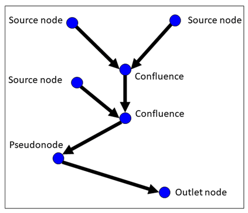
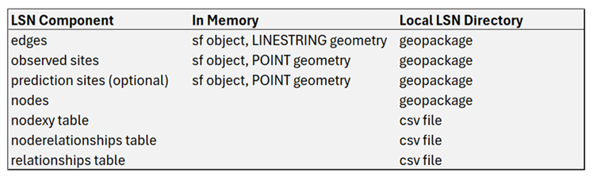

```{r setup, include = FALSE}
# # jss style
# knitr::opts_chunk$set(prompt=TRUE, echo = TRUE, highlight = FALSE, continue = " + ", comment = "")
# options(replace.assign=TRUE, width=90, prompt="R> ")

# rmd style
knitr::opts_chunk$set(collapse = FALSE, comment = "#>", warning = FALSE, message = FALSE)

# load packages
library(SSNbler)
```

# Background

Data collected in streams frequently exhibit unique patterns of spatial
autocorrelation resulting from the branching network structure,
longitudinal (i.e., upstream/downstream) connectivity, directional
water flow, and differences in flow volume upstream of junctions
(i.e., confluences) in the the network 
[@peterson2013modelling]. In addition, stream networks are embedded
within geographic (i.e., 2-D) space, with the terrestrial landscape
often having a strong influence on observations collected on
the stream network. [@ver2010moving] describe how to fit spatial
statistical models on stream networks (i.e., spatial stream-network
models) that capture the unique and complex spatial dependencies
inherent in streams. These stream network models can be fit in **R**
using the `SSN2` package [@dumelle2024SSN2]. However, users must
provide the spatial, topological, and attribute data in a specific format called an SSN object in order to fit models
using `SSN2`. The **R** package`SSNbler` is used to generate, format,
assemble and validate data in the SSN object for use with `SSN2`.

We provide an overview of using `SSNbler` to create an
SSN object for use with `SSN2` in this vignette. The `SSNbler` package
contains a few data sets we use here:

-   `MF_streams`: An `sf` object with `LINESTRING` geometry
    representing the Middle Fork stream network in Idaho, USA.
-   `MF_obs`: An `sf` object with `POINT` geometry containing observed data observed at 45
    unique locations on `MF_streams`.
-   `MF_pred1km`: An `sf` object with `POINT` geometry containing
    unsampled locations spaced at one kilometer intervals throughout
    `MF_streams`. This prediction dataset represents locations where
    predictions of some response variable (i.e., dependent variable) may be
    desired. 

There are two additional prediction data sets, `MF_CapeHorn` and `MF_Knapp`, that
contain unsampled locations on the Middle Fork where
predictions may be desired.

These datasets are dynamically loaded with `SSNbler`. In this
vignette, however, we demonstrate a more realistic workflow for the
user. We start with a collection
of spatial datasets (e.g., geopackages) representing the stream
network, observed data, and prediction data (optional), which are
required to create an SSN object used to fit spatial stream-network models. Geopackages representing these Middle
Fork data are also installed with `SSNbler` and can be found in the
`streamdata` folder. To prevent `SSNbler` functions from reading and writing to
this folder, we copy it to R's temporary
directory and store the path to this folder:

```{r}
copy_streams_to_temp()
path <- paste0(tempdir(), "/streamsdata")
```
Then we can read the relevant data into our R session using the
`st_read` function from the `sf` package:
```{r}
library(sf)
MF_streams <- st_read(paste0(path, "/MF_streams.gpkg"))
MF_obs <- st_read(paste0(path, "/MF_obs.gpkg"))
MF_pred1km <- st_read(paste0(path, "/MF_pred1km.gpkg"))
```
Notice that the line and point features have `LINESTRING`
and `POINT` geometry types, which are required in `SSNbler`. If
these datasets had `MULTILINESTRING` or
`MULTIPOINT` geometry types, the `sf` function `st_cast` could be used to convert to
the required geometry types. Also, the datasets must all have the same
map projection, which must be a projected coordinate system, rather
than a geographic coordinate system (i.e., not Latitude and
Longitude). The `sf` function `st_transform` can be used to
reproject sf objects in *R*. 

Before working with any of these files, and eventually creating an SSN
object, we visualize the stream network, observed sites, and
prediction sites using the `ggplot2` R package.

We load the `ggplot2` R package and visualize the stream network, with
prediction and observed locations: 

```{r}
library(ggplot2)

ggplot() +
  geom_sf(data = MF_streams) +
  geom_sf(data = MF_pred1km, colour = "purple", size = 1.7) +
  geom_sf(data = MF_obs, color = "blue", size = 2) 
  
```

# The Landscape Network

SSN objects contain all the spatial, topological, and attribute information required to fit a
spatial stream network model [@peterson2014stars]. They rely on a
landscape network (LSN; Figure \@ref(fig:valid-nodes), which is a directional graph used to
represent geographic and topological relationships 
[@theobald2006functional]. Streams data are represented as a collection of directed `edges`, where
the directionality is determined by the digitized direction of the
line features. A `nodes` dataset is created when the LSN is
generated in *R* using `lines_to_lsn()`. There are four topologically
valid node categories in a LSN: 

-   **Source**: Water flow originates at these nodes and flows downstream. An edge that begins at a source node is called a headwater segment. Source nodes do not receive flow from any upstream edges.
-   **Outlet**: Flow terminates at these nodes. This node is the most downstream point in the edge network. We refer to an edge that terminates at an outlet as an outlet segment. Note that a streams dataset may contain multiple subnetworks with associated outlets. 
-   **Confluence**: Multiple edges converge, or flow into, a single node. 
-   **Pseudonode**: One edge flows in and one edge flows out of a
    single node. While these nodes are not topologically problematic,
    an excessive number of pseudonodes can slow down geoprocessing
    operations for large datasets.

<figure>
  
  <figcaption>Figure 1: A landscape network (LSN). Nodes are denoted by blue circles, with the node category labelled. Edges are denoted by black arrows, with the arrow indicating flow direction (i.e. digitized direction).</figcaption>
</figure>

Each edge is associated with two nodes, which correspond to the
upstream and downstream endpoints of the edge. When more than one edge
flows into or out of the node, they *share* a node. Thus, there should
always be a single node at the intersection of edges. If there is more
or less than one node at an intersection, it is a topological
error. If these errors are not corrected, the connectivity between
line features and the observed and prediction sites associated with
them will not be accurately represented in the SSN object or the
spatial statistical models subsequently fit to the data. 

In this vignette, we assume that `MF_streams` has already been checked and
topologically corrected. Please see the tutorial 'Correcting
topological errors using SSNbler and QGIS' for additional information
about identifying and correcting toplogical errors in the LSN, as well
as topological restrictions that are not permitted in a LSN.

The LSN is created using the `lines_to_lsn()`
function, which generally requires at least a few arguments:

* `streams`: An `sf` object with `LINESTRING` geometry that represents the stream network. 
* `lsn_path`: A path to the directory in which to store the LSN
  output. This directory will be created if it does not exist.
* `check_topology`: Logical indicating whether to check for
  topological errors in `streams`.
* `snap_tolerance`: Two nodes separated by a Euclidean distance less than or
  equal to `snap_tolerance` will be assumed connected. Distance is
  measured in map units (i.e., projection units for `streams`).
* `topo_tolerance`: Two nodes separated by a map distance less than or equal to `topo_tolerance` are flagged as potential topological errors in the network. 

The `MF_streams` data has an Albers Equal Area Conic projection (EPSG
102003) measured in meters. We create the LSN associated with `MF_streams` by running 
```{r}
edges <- lines_to_lsn(
  streams = MF_streams,
  lsn_path = path,
  check_topology = TRUE,
  snap_tolerance = 1,
  topo_tolerance = 20,
  overwrite = TRUE
)
```
The `lines_to_lsn()` function writes a minimum of five files to `lsn_path`:

* `nodes.gpkg`: A geopackage with `POINT` geometry features
  representing LSN nodes. It contains a unique node identifier column),
  `pointid`, and another column  named `nodecat`, which contains the node type (pseudonodes, confluences, sources, outlets).
* `edges.gpkg`: A geopackage with `LINESTRING` geometry features
  representing LSN edges, which contains all of the columns in
  `streams` and unique edge identifier column named `rid`. 
* `nodexy.csv`: A comma-separated value (csv) file with a unique node
  identifier, `pointid`, along with the x and y coordinates for each node.
* `noderelationships.csv`: A csv file with three columns used to
  describe the directional relationship between nodes and edges.  The
  column `rid` represents the edge, while the `fromnode` and `tonode`
  contain the `pointid` value for the upstream and downstream node,
  respectively.
* `relationships.csv`: A csv file that describes the directional
  relationship between edgess using two columns named `fromedge` and
  `toedge`, which contain the edge `rid` values. 
  
Together these five files describe the geographic and topological relationships
between edges in the network, while preserving flow direction. 

When `check_topology = TRUE`, the `lines_to_lsn` also checks the
topology of the network. It is important to pay attention to the output messages written to the *R*
console when `lines_to_ssn` is run. Notice the message 'No obvious topological errors detected
and node_errors.gpkg was NOT created.' This suggests that the LSN
edges are error free, but it is still a good idea to visually assess
maps of the node `nodecat` values to look for obvious errors; as
described in the topology editing tutorial mentioned previously. If
the message indicators that a sixth file, `node_errors.gpkg` was
created, then potential topological errors were identified. These
errors must be checked and corrected before moving on to the next
spatial processing steps. 

After creating the LSN using `lines_to_lsn()`, observed and prediction
datasets are incorporated into the LSN using `sites_to_lsn()`. The
function snaps (i.e., moves) point locations
to the closest edge location and generates new information describing
the topological relationships between edges and sites in the LSN. `sites_to_lsn()`
generally requires these arguments:

* `sites`: An `sf` object with `POINT` geometry that contains the
  observed or prediction locations.
* `edges`: An `sf` object containing the edges in the LSN generated
  using `lines_to_lsn`.
* `snap_tolerance`: A numeric distance in map units. Sites whose
  distance to the nearest edge feature is less than are equal to `snap_tolerance`
  are snapped to the relevant edge. Sites whose distance to the
  nearest edge feature is greater than `snap_tolerance` are not
  snapped to an edge or included in the output. 
* `save_local`: If TRUE (the default), the snapped sites are written
  to `lsn_path`. 
* `lsn_path`: Pathname specifying where to store the snapped sites in
  geopackage format. This is typically the LSN directory where the
  `edges` are stored. 
  
The `sites_to_lsn` function is run using the following code: 

```{r}
obs <- sites_to_lsn(
  sites = MF_obs,
  edges = edges,
  lsn_path = paste0(path, "/obs.gpkg"),
  snap_tolerance = 100,
  save_local = TRUE # the default
)
```

The `sites_to_lsn()` function writes `obs.gpkg` to `lsn_path`. The new
geopackage contains the original columns in `sites`, as well as three
new columns: 

* `rid`: The edge `rid` value where the snapped site resides. 
* `ratio`: The proportional length of the edge found between the
  downstream end node of the edge and the site location.
* `snapdist`: The distance in map units that the site was moved. 

The `rid` value provides information about where a site is in relation
to all of the other edges and sites in an LSN, while the `ratio` value
can be used to identify where *exactly* a site is on the edge. Note
that the `sites_to_lsn` function must be run, even if the site
locations already intersect the edge features.

It is very important to pay attention to the message output to the *R*
console because it indicates how many of the sites were successfully
snapped to the LSN. If some sites were not snapped, the
`snap_tolerance` value can be increased until all sites are
snapped. The `snapdist` column can be used to identify sites that were
moved relatively large distances. It is prudent to check the new
location of these sites to ensure they have been snapped to the
correct edge. 

Prediction datasets are optional, but must also be added to the LSN
using `sites_to_lsn()`if the aim is to make predictions using a
spatial stream-network model:
```{r}
preds <- sites_to_lsn(
  sites = MF_pred1km,
  edges = edges,
  lsn_path = paste0(path, "/pred1km.gpkg"),
  snap_tolerance = 100
)
```

Note that a LSN can only contain one set of observations, but an
unlimited number of prediction datasets. However, the `sites_to_lsn`
function must be run separately for every observed and prediction
dataset. While this may at first seem tedious, it provides the user
the opportunity to examine each output dataset individually, ensuring
that all sites are snapped to the LSN and that they are snapped to the
correct edge feature.

The `lines_to_lsn` and `sites_to_lsn` functions are used to produce a
topologically corrected LSN containing edges, observed sites, and
prediction sites (optional). This LSN provides the foundation for all
of the remaining spatial data processing steps and the spatial
statistical models. Creating the LSN is often the most time consuming
step in the spatial statistical modelling workflow; especially if the
edges or sites contain a large number of features or the stream
network has many topological errors. However, it is critical that the
spatial and topological relationships are accurately represented in
the LSN and the subsequent spatial statistical models.

The LSN created using `lines_to_lsn()` and `sites_to_lsn()` is stored in memory and also in a local folder
defined using `lsn_path` (Figure \@ref(fig:LSN Storage)). The LSN contains at least six components
(ref figure). The edges, nodes, and observed sites contain the spatial
features and attribute data *within* each dataset, while the three
tables (nodexy, noderelatonships, and relationships) describe the
relationships *between* edges and sites. These tables are not stored
in memory, but are accessed by subsequent `SSNbler`
functions. Prediction datasets may also be included in the LSN if
prediction is desired (e.g., pred1km).

<figure>
  
  <figcaption>Figure 2: LSN components are stored in 1) memory as sf
  objects and 2) a local LSN directory as geopackages and csv files,
  which are accessed using other `SSNbler` functions.</figcaption>
</figure>

Once the LSN has been created, the next steps are to calculate the
spatial information needed to fit spatiat statistical stream-network
models. 

# Calculating Upstream Distance

The 'upstream distance' represents the distance between the lowermost
location on a stream network (i.e. network outlet) and each
feature. For an edge, the distance is measured to the upstream end
node of the line feature and for sites it is the point feature
itself. This information is used to calculate the directional hydrologic distances
(i.e., distance between locations when movement is restricted to the
stream network) between observed and prediction locations. 

The upstream distance of edge $j$ is the distance from the stream outlet to the
upstream end node of each edge, calculated as the sum of the length of all
edges starting from the outlet and moving upstream through to edge
$j$. 

The upstream distance for each edge is calculated using the
`updist_edges()` function, which generally requires a few arguments:

* `edges`: An `sf` object containing the edges in the LSN generated
  using `lines_to_lsn`.
* `lsn_path`: LSN pathname where the `edges` and `relationships.csv`
  are stored. 
* `calc_length`: A logical indicating whether a column representing
  line length should be calculated and added to `edges`. It is
  important to set `calc_length=TRUE` if the line features were edited
  to remove topological errors.  


```{r}
edges <- updist_edges(
  edges = edges,
  lsn_path = path,
  calc_length = TRUE
)
```


* `sites`: An `sf` object with `POINT` geometry that contains the
  observed or prediction locations.
* `edges`: An `sf` object containing the edges in the LSN generated
  using `lines_to_lsn`.
* `snap_tolerance`: A numeric distance in map units. Sites whose
  distance to the nearest edge feature is less than are equal to `snap_tolerance`
  are snapped to the relevant edge. Sites whose distance to the
  nearest edge feature is greater than `snap_tolerance` are not
  snapped to an edge or included in the output. 
* `save_local`: If TRUE (the default), the snapped sites are written
  to `lsn_path`. 
* `lsn_path`: Pathname specifying where to store the snapped sites in
  geopackage format. This is typically the LSN directory where the
  `edges` are stored. 


Two columns are added to `edges` and `edges.gpkg`: `Length`, the
length of each edge; and `upDist`, the upstream distance of each edge.

The upstream distance of site $j$ is the distance from the stream
outlet to the site, calculated as the sum of the length of all edges
downstream of the edge that site $i$ is on (edge $j$) plus the length
the edge $j$ downstream of site $i$. Upstream distance is calculated
for each edge using the `updist_sites()` function, which generally
requires a few arguments:

* `sites`: A named list of one or more `sf` objects with `POINT` geometry that have been snapped to the LSN using `sites_to_lsn()`.
* `edges:` An `sf` object with `LINESTRING` geometry created using `lines_to_lsn()` and `updist_edges()`.
* `length_col`: The name of the column in `edges` that represents edge length. Typically, this is named `"Length"`
* `lsn_path`: The path to the LSN specified via `lines_to_lsn()`

```{r}
site.list <- updist_sites(
  sites = list(obs = sites, pred1km = preds),
  edges = edges,
  length_col= "Length",
  lsn_path = path,
  overwrite = TRUE
)
```

# Calculating Additive Function Values (AFVs)

The impact of branching in the stream network is captured via spatial
weights that depend on additive function values. The additive function
values represent the influence of downstream factors such as flow
volume or watershed area that are variable throughout the stream
network. Addition function values are created for each edge using the
`afv_edges()` function, which generally requires a few arguments:

* `edges`: An `sf` object with `LINESTRING` geometry created using `lines_to_lsn()`.
* `lsn_path`: The path to the LSN specified via `lines_to_lsn()`.
* `infl_col`: The name of the column in `edges` used to measure the downstream influence of each feature. 
* `segpi_col`: The name of the column created in `edges` that stores the segment proportional influence values for each feature which capture the proportion of influence each feature has on the immediate downstream confluence.
* `afv_col`: The name of the column created in `edges` that stores the additive function value for each feature.

We will use the variable `h2oAreaKm2` in `edges`, which represents watershed area, to create the additive function value: 

```{r}
edges <- afv_edges(
  edges = edges,
  infl_col = "h2oAreaKm2", 
  segpi_col = "areaPI",
  afv_col = "afvArea",
  lsn_path = path,
  overwrite = TRUE
)
```

Once the additive function values have been added to `edges`, they can be joined to the observed and (if relevant) prediction sites:
```{r}
site.list <- afv_sites(
  sites = site.list,
  edges = edges,
  afv_col = "afvArea",
  save_local = TRUE,
  lsn_path = path,
  overwrite = TRUE
)

```

For more on additive function values, see @ver2010moving and
@peterson2010mixed.

# Assembling the SSN Object

After creating the LSN, calculating upstream distance, and calculating
additive function values, we are ready to assemble an SSN object for
use with `SSN2` to create spatial stream network models. The function
that creates the SSN object is `ssn_assemble()`, which generally
requires a few arguments:

* `edges`: An `sf` object with `LINESTRING` geometry created using `lines_to_lsn()`, `updist_edges()`, and `afv_edges()`.
* `lsn_path`: The path to the LSN specified via `lines_to_lsn()`.
* `obs_sites:` An `sf` object with `POINT` geometry created using `sites_to_lsn()`, `updist_sites()`, and `afv_sites()`.
* `obs_sites:` A list of prediction `sf` objects  with `POINT` geometry created using `sites_to_lsn()`, `updist_sites()`, and `afv_sites()`.
* `ssn_path`: The path to write out the SSN object. `ssn_path` must contain a `.ssn` extenstion, which places relevant files in a `.ssn` folder.
* `import`: Should the SSN object be automatically imported for use with `SSN2`?

```{r}
mf04p_copy <- ssn_assemble(
  edges = edges,
  lsn_path = path,
  obs_sites = site.list$obs,
  preds_list = list(pred1km = site.list$pred1km),
  ssn_path = paste0(path, "/MF.ssn"),
  import = TRUE,
  overwrite = TRUE
)
```

# Creating a Spatial Stream Network Model Using SSN2

Then we can create a stream network model relating mean summer
tempearture to precipitation using exponential tailup, spherical
taildown, and Gaussian Euclidean covariance functions. To learn more
about `SSN2`, visit the package website at
[https://usepa.github.io/SSN2/](https://usepa.github.io/SSN2/).

```{r}
library(SSN2)
ssn_create_distmat(mf04p_copy)
ssn_mod <- ssn_lm(
  formula = Summer_mn ~ AREAWTMAP,
  ssn.object = mf04p_copy,
  tailup_type = "exponential",
  taildown_type = "spherical",
  euclid_type = "gaussian",
  additive = "afvArea"
)
summary(ssn_mod)
```

# Function Glossary

Here we list and provide brief descriptions for some commonly used
`SSNbler` functions to create and assemble SSN objects:

-   `lines_to_lsn()`: Text.
-   `sites_to_lsn()`: More text.
-   `updist_edges()`: Text.
-   `updist_sites()`: More text.
-   `afv_edges()`: Text.
-   `afv_sites()`: More text.
-   `ssn_assemble()`: Text.
-   Others?: More text.

# R Code Appendix {.unnumbered}

```{r get-labels, echo = FALSE}
labs <- knitr::all_labels()
labs <- setdiff(labs, c("setup", "get-labels"))
```

```{r all-code, ref.label=labs, eval = FALSE}
```

# References {.unnumbered}

::: {#refs}
:::
